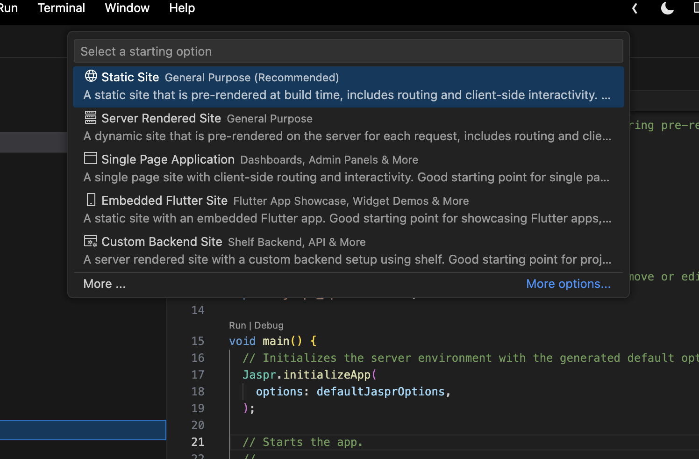

The official [VS Code](https://code.visualstudio.com/) extension for the Jaspr web framework.

## Installation

This extension also requires the [Dart VSCode Extension](https://marketplace.visualstudio.com/items?itemName=Dart-Code.dart-code) to be installed.

## Creating a new project

To create a new Jaspr project, open the command palette (`Ctrl+Shift+P`) and select **Jaspr: New Project**. You are ask to choose from several templates and set a project folder.

## Debugging a Jaspr application

To run and debug a Jaspr applications, launch it using F5 or the Debug menu. The extension will start the debug process and attach the Dart debugger to it. 

---

When developing a Jaspr project in `static` or `server` mode, this will open **two** separate debugging sessions, one for the server and one for the client. Switch between the two using the debugging sidebar or process dropdown.

| Sidebar | Dropdown. |
|---|---|
|  | 

Both processes will be managed by the main Jaspr terminal.

To stop the server, focus the terminal and press `Ctrl+C`. This will stop both debugging sessions and the main process.
You can also detach the debugging sessions individually using the detach button in the debug bar, but this will keep the app running.

## Jaspr Commands

Through the command palette, you can access the following Jaspr commands:

- **Jaspr: New Project**: Create a new Jaspr project.
- **Jaspr: Server**: Start the Jaspr dev server.
- **Jaspr: Clean**: Clean the Jaspr project folder.
- **Jaspr: Doctor**: Run the Jaspr doctor command.